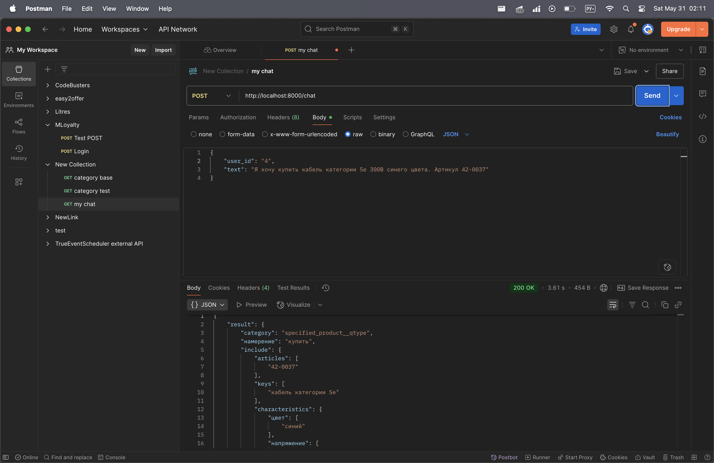
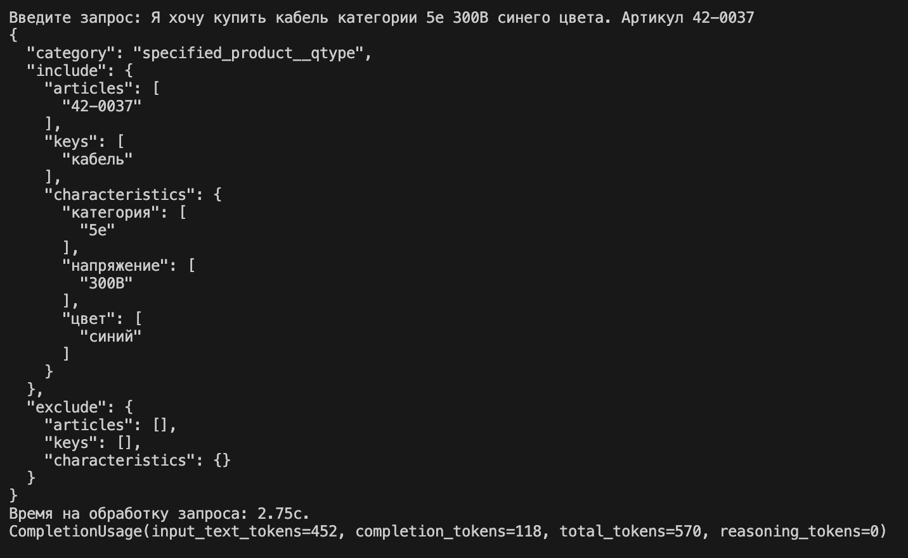
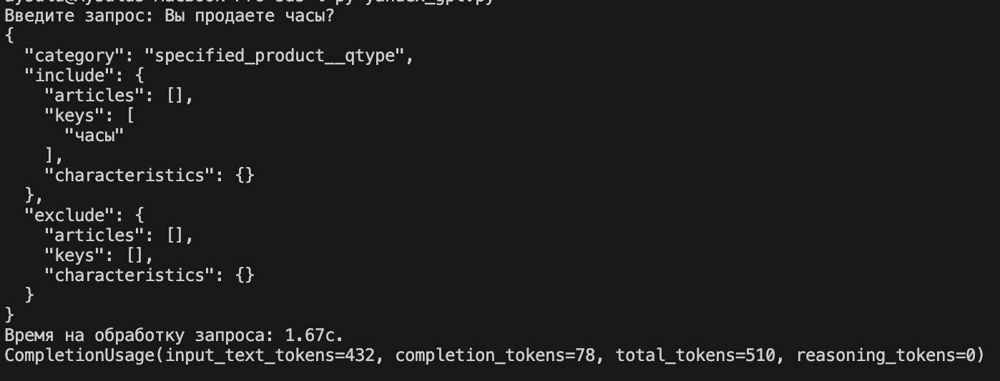
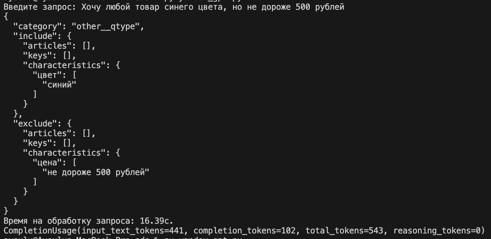
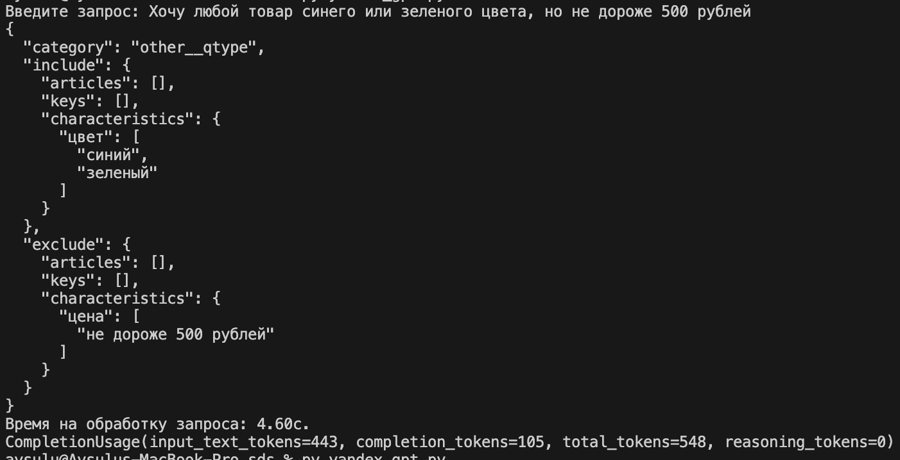

### Updates

**30.05.25**: Добавлена поддержка WebAPI и многопоточности, сокращено количество используемых токенов и время ответа до 3 секунд максимально

**28.05.25**: обновлен промт с учетом форматирования

### Примеры запросов

0. Пример WebAPI запроса

1. Пример обычного запроса

2. Пример запроса о продукте не из нашего каталога (чуть позже добавим векторный поиск

3. Иногда запросы очень долго обрабатываются (случается редко, но все же)

4. При повторных запросах время ответа уменьшается

